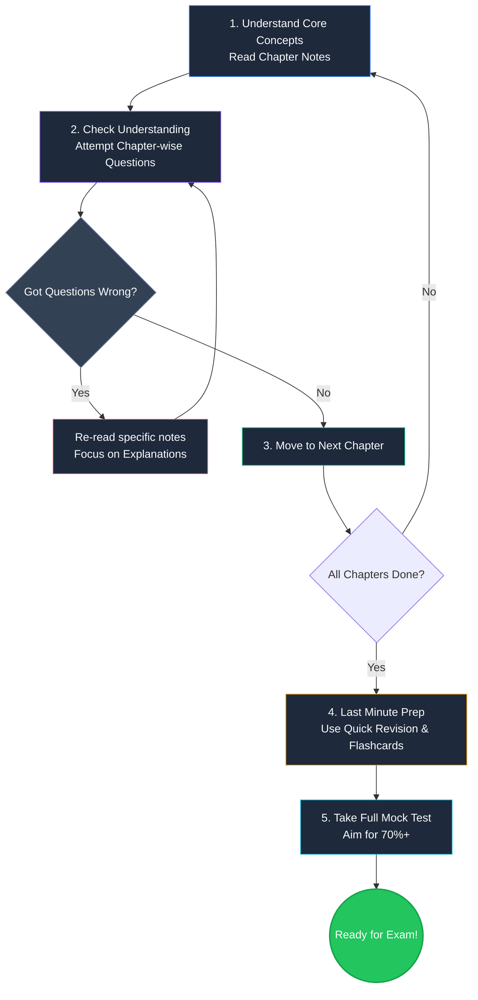

# ☁️ Certification Study Hub — Your Cloud Certification Study Partner

> This repo is your friendly study companion for cloud certification preparation.

---

## 📌 What Is This Repo?

**certification-study-hub** is a simple, student-friendly repository to help you prepare for:

1. 🟧 **AWS Certified Cloud Practitioner (CLF-C02)**
2. 🟦 **Claude Architect Foundation**

This is not an exam dump. This is not a copy-paste cheat sheet.

This is a proper study guide — written in simple Indian English — so you can actually understand what you are studying, not just memorize it.

---

## 👨‍🎓 Who Is This For?

This repo is for you if:

- You are a **beginner** starting your cloud journey
- You want to clear your **AWS Cloud Practitioner** exam
- You are exploring **Claude AI** and want the **Architect Foundation** certificate
- You want **simple explanations**, not heavy technical jargon
- You learn better with **stories, examples, and scenarios**
- You want **original practice questions** (not copied exam dumps)

---

## 📚 What Will You Find Here?

| Section | What's Inside |
|---|---|
| `aws-cloud-practitioner/` | Chapter notes, concepts, scenarios, practice questions |
| `claude-architect-foundation/` | Claude AI concepts, architecture notes, use-case guides |
| `flashcards/` | Quick revision cards for last-minute prep |
| `study-plans/` | Day-wise and week-wise study schedules |
| `mock-tests/` | Full-length and chapter-wise mock tests |
| `templates/` | Blank templates so you can add your own notes |
| `contribution-guide.md` | How to add your notes and help other students |

---

## 🟧 AWS Certified Cloud Practitioner

The **AWS Cloud Practitioner** exam (CLF-C02) tests your basic understanding of:

- What is Cloud Computing
- AWS Global Infrastructure (Regions, AZs, Edge Locations)
- Core AWS Services (EC2, S3, RDS, Lambda, etc.)
- Cloud Security and Shared Responsibility Model
- Billing, Pricing, and Support Plans
- Cloud Adoption Framework

### How We Cover It

```
aws-cloud-practitioner/
├── 01-cloud-concepts/
├── 02-aws-global-infrastructure/
├── 03-core-services/
├── 04-security-and-compliance/
├── 05-billing-and-pricing/
├── 06-cloud-technology-and-services/
├── practice-questions/
├── mock-tests/
└── revision-notes/
```

Each chapter has:
- Simple concept notes
- Real-life Indian examples (like using S3 as a "digital locker")
- Scenario-based questions
- Memory tricks

---

## 🟦 Claude Architect Foundation

The **Claude Architect Foundation** certificate tests your understanding of:

- What is Claude AI and how it works
- Responsible AI and safety practices
- How to design systems using Claude
- Prompt engineering basics
- Use cases and architecture patterns

### How We Cover It

```
claude-architect-foundation/
├── 01-introduction-to-claude/
├── 02-agentic-patterns/
├── 03-tool-use-and-mcp/
├── 04-structured-output-and-extraction/
├── 05-claude-code-and-workflows/
├── practice-questions/
└── revision-notes/
```

---

## 📅 The Visual Study Path

Here is the most effective way to go from beginner to certified for any course in this repo:



Find detailed daily schedules inside the `study-plans/` folder.

**Quick Reference:**

| Exam | Suggested Study Time | Difficulty |
|---|---|---|
| AWS Cloud Practitioner | 4–6 weeks (1–2 hrs/day) | Beginner |
| Claude Architect Foundation | 2–3 weeks (1 hr/day) | Beginner |

Start with `study-plans/how-to-study.md` to understand how to use this repo properly.

---

## 🎯 Where to Focus to Get Certified (Based on Mock Tests)

Before you begin, understand where the bulk of the exam questions come from. Focus your energy on these high-weightage topics:

### 🟧 AWS Cloud Practitioner Focus Areas
> **Over 60% of the exam** focuses on Security and Cloud Technology. Pay extra attention to:
- **Service Comparisons**: Know exactly when to use *Macie* (PII data) vs *GuardDuty* (threats) vs *Inspector* (vulnerabilities).
- **Serverless Architecture**: The classic `API Gateway + Lambda + DynamoDB` pattern appears frequently.
- **Billing & Cost**: Differentiate between *Cost Explorer* (past analysis), *Pricing Calculator* (future estimates), and *AWS Budgets* (alerts).
- **Shared Responsibility**: Always remember AWS manages the hypervisor and physical hardware; you manage the OS, data, and IAM.

### 🟦 Claude Architect Foundation Focus Areas
> **~50% of the exam** focuses on Tool Use and Agentic Patterns. Pay extra attention to:
- **Tool Use & MCP**: Understand that MCP connects to servers, while Tool Use is how Claude executes functions. Always use specific, detailed tool descriptions.
- **Handling Data Absence**: If extraction data is missing, the schema must return `null` — Claude should never fabricate missing data.
- **Safety Gates**: Irreversible actions (like deleting resources or sending emails) must have a human-in-the-loop confirmation step.
- **Code Review**: Independent reviews (in a fresh session) are necessary to avoid confirmation bias from the code generator.

---

## 📝 Practice Questions & Mock Test

All practice questions in this repo are **100% original**.

- They are written to help you think like the exam
- They are **not** copied from any real exam
- Each question has a **detailed explanation**

### 🔥 Interactive 65-Question Mock Test

Download and open in your browser for a full timed experience:

👉 **[ccp-mock-test-65q.html](aws-cloud-practitioner/mock-tests/ccp-mock-test-65q.html)** — 90 min timer, auto-scoring, and detailed review

Find more inside:
- `aws-cloud-practitioner/practice-questions/`
- `aws-cloud-practitioner/mock-tests/`
- `aws-cloud-practitioner/revision-notes/quick-revision.md`

---

## ⚡ Quick Start

```
Step 1 → Read this README fully
Step 2 → Go to study-plans/how-to-study.md
Step 3 → Pick your exam (AWS or Claude)
Step 4 → Follow the chapter order
Step 5 → Attempt practice questions after each chapter
Step 6 → Revise using flashcards
Step 7 → Take mock tests in the last week
```

---

## 🤝 How to Contribute

This repo grows when students like you add their notes!

See `contribution-guide.md` for full details.

**In short:**
1. Fork this repo
2. Add your notes using the templates in `templates/`
3. Submit a Pull Request with a simple description
4. We review and merge

All contributions must be **original** — no copied exam content.

---

## ⚠️ Disclaimer

> All practice questions, scenarios, and study notes in this repository are **100% original content** created for educational purposes only.
>
> This repository does **not** contain:
> - Real exam questions
> - Exam dumps
> - Leaked certification content
>
> If you are looking for shortcuts, this is not the right place.
> If you want to truly learn and clear the exam, you are in the right place.

---

## 🙏 A Note from the Maintainer

Cloud certifications can feel scary at first. But once you understand the basics, they become very manageable.

This repo was made with the belief that every student — regardless of their background — can clear these exams with the right guidance and consistent effort.

Study daily. Ask questions. Help each other.

**All the best. You've got this! 💪**

---

*Made with ❤️ for the Indian student community and cloud learners everywhere.*
